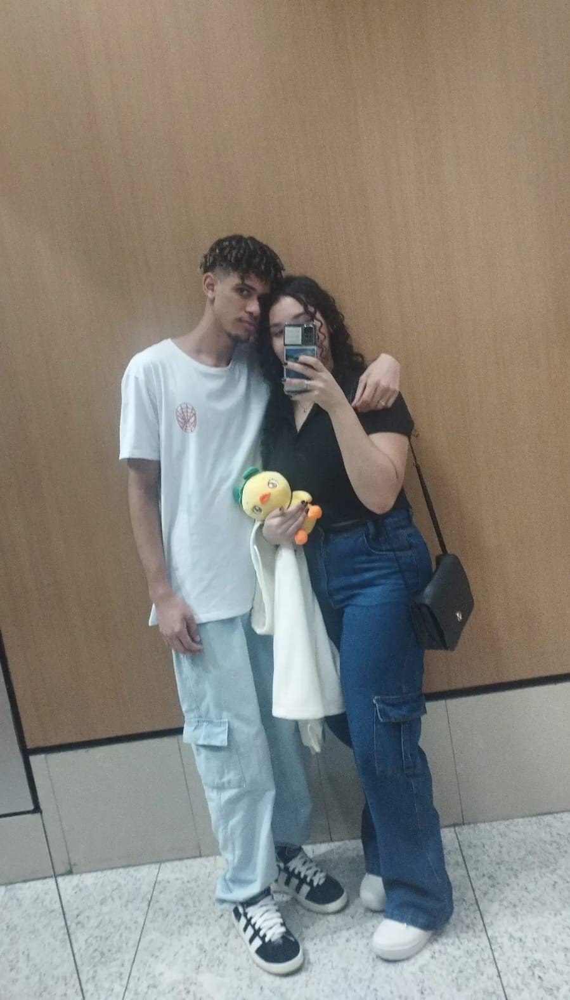

<html lang="pt-BR">
<head>
    <meta charset="UTF-8">
    
    <title>I Love You</title>
    
    
</head>
<body>
    

        
        <h1>Sarah ❤️ Erick</h1>
        
        

            
            
            
            
            
            
        

        

        

            <b>Para você se lembrar de quantos dias se passaram desde da minha melhor decisão...E que a gente possa voltar aqui e ver que os dias só aumentaram.
            
            <b>A melhor parte do meu dia é sempre quando você está do meu lado.
            
            <b>Eu te amo demais muito mesmo, meu amor por você será para sempre sempre.
            
            

    
            <iframe width="560" height="315" src="https://www.youtube.com/embed/n5i3QRvPA9Y?si=J4lAouM87zNoz6bT&amp;controls=0&amp;start=2" title="YouTube video player" frameborder="0" allow="accelerometer; autoplay; clipboard-write; encrypted-media; gyroscope; picture-in-picture; web-share" referrerpolicy="strict-origin-when-cross-origin" allowfullscreen></iframe>
    
